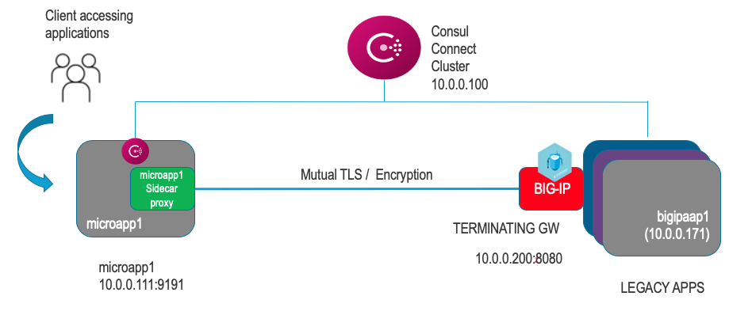

# BIG-IP Terminating Gateway with Consul Connect
- This repository will provision BIG-IP VE (Pay as you Grow), Consul Connect & NGINX servers in AWS

# Demo

# Architecture


# How to use this repo

## Provision Infrastructure

The `terraform` directory has tf files for creating instances for Consul Connect, f5, iam policy, Client machine,  nginx servers. 

- `main.tf` refers to what region is used on aws.
- `client.tf` is used to create ubuntu machine to test curl / http 
- `bigipapp1.tf` is used to configure nginx server which act as a legacy app.
- `ssh.tf` is used to create the key pairs.
- `vpc.tf` is used to create a new vpc and also to define the aws security groups.
- `outputs.tf` is used to output and display F5 BIG-IP management IP and F5 BIG-IP dynamic Password


## Steps 
- Clone the repository & change working directory to terraform
```
git clone https://github.com/f5devcentral/bigip_consul_tg.git
cd tffiles
```
- Create Terraform run
- Modify `terraform.tfvars.example` and add a prefix to identify your resources
- Rename `terraform.tfvars.example` to `terraform.tfvars`

```
terraform init
terraform plan
terraform apply
```

  - This will create BIG-IP, consul connect, client vm, NGINX instance on AWS
  - This will also seed a `terraform.tfvars` file in the `as3` directory for use in the next step
  - This step
  - It may take up to 5 minutes or after the run is complete for the environment to become ready. The URL for the BIG-IP UI is provided as part of the output.  Verify you can reach the UI before proceeding.


## Configure BIG-IP


Next we need to download and load AS3 rpm into BIG-IP, for AS3 documentation and download please refer to https://github.com/F5Networks/f5-appsvcs-extension  note :- this currently uses AS3 3.17.1 rpm image

```
terraform init
terraform plan
terraform apply
```

- Do terraform plan & apply, this will deploy the AS3 declarative JSON for service discovery on BIG-IP. It will use as3.tf file. You can review the `terraform.tfvars` file that was generated in the previous step or rename and edit `terraform.tfvars.example` file in that directory to pass the necessary variables to terraform, or enter them manually via the CLI, copying the format of the values in the file.
- Now you have Virtual IP and Pool information already configured on BIG-IP in partition defined in the consul.json file.

# Few manual steps

- Once all the instances are UP do the following 
1. Run the command ```consul connect proxy -sidecar-for client``` on the client vm
2. Extract Root cert & leaf cert for bigipapp1 application using the below commands

   ```curl --silent http://IP_address_ofconsul:8500/v1/agent/connect/ca/leaf/bigipapp1 | jq --raw-output .CertPEM >   bigipapp1.cert``` 
   
   ```curl --silent http://IP_address_of_consul:8500/v1/agent/connect/ca/leaf/bigipapp1 | jq --raw-output .PrivateKeyPEM > bigipapp1.pem```

# How to test?
- Here we have two applications running a] Client application named as "client" which is running in the   service mesh on a vm. and b] BIG-IP instance with Virtual Server and NGINX server running as pool memb  er. Below are the hcl files for both services

a] Client service
```
{
	"service": {
		"name": "client",
		"port": 80,
		"checks": [{
			"id": "client",
			"name": "nginx TCP Check",
			"tcp": "10.0.0.111:80",
			"interval": "10s",
			"timeout": "1s"
		}],
		"connect": {
			"sidecar_service": {
				"proxy": {
					"upstreams": [{
						"destination_name": "bigipapp1",
						"local_bind_port": 9191
					}]
				}
			}
		}
	}
}
```

### Folder as3
Folder as3 has three files, `main.tf`, `bigipapp1.json` and `variables.tf`. `main.tf` is used to provision `bigipapp1.json` template to BIG-IP once its ready.
This module attempts to download the rpom automatically, but you can also download the AS3 rpm module from https://github.com/F5Networks/f5-appsvcs-extension before doing terraform apply.

### Folder services
`client.sh` is used to deploy client vm which exists in consul mesh
`consul.sh` is used to install consul connect
`f5.tpl` is used to change the admin password.
`nginx.sh` is used to install  nginx servers


### Product Versions
- BIG-IP image used is 15.1 version
- AS3 rpm used is [3.17.1 version](https://github.com/F5Networks/f5-appsvcs-extension/raw/v3.17.1/dist/latest/f5-appsvcs-3.17.1-1.noarch.rpm)
- HashiCorp & F5 based on https://clouddocs.f5.com/cloud/public/v1/aws/AWS_singleNIC.html
